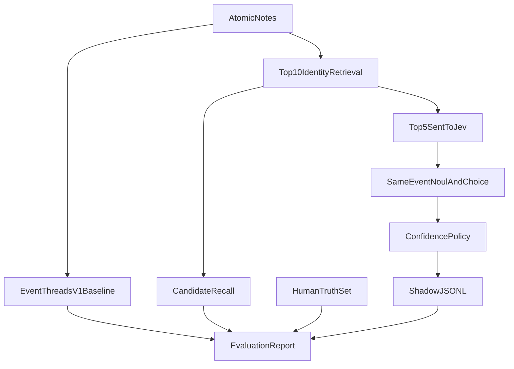

# Jev Shadow Evaluation

Atomic Notes, transcription, evidence windows, exact-quote checks, and Supabase provenance stay as they are. Event Threads V1 stays in the tree and stays non-persistent. Its identity scorer changes role from final merge truth to candidate retrieval. Jev answers only bounded questions. TypeScript owns thresholds, and this milestone writes no event, theme, or note rows.

The 86-note collapse is not checked into the repo. The evaluator takes one or more `source_item_id` values, loads `intel.creator_atomic_notes`, runs the existing dry-run clusterer, and emits a labeling sheet. Human labels are a committed fixture. Live Jev output is a gitignored JSONL log.

## Freeze, do not delete

Leave [lib/eventThreads/identity.ts](lib/eventThreads/identity.ts) merge rules alone: `MERGE_SCORE`, `ATTACH_SCORE`, `shouldMergeThreadIdentities()`, and `clusterEntriesIntoThreads()` stay the V1 baseline. [lib/eventThreads/build.ts](lib/eventThreads/build.ts) still throws `EVENT_THREADS_PERSISTENCE_DISABLED` unless `--dry-run`.

Do not edit [lib/creatorNotes/contentRole.ts](lib/creatorNotes/contentRole.ts), extraction, quote verification, or Theme Memory membership. Theme membership is a later Choice on this same provider, after same-event false-merge numbers are acceptable.

Add a short freeze note in [lib/eventThreads/constants.ts](lib/eventThreads/constants.ts) and [docs/jev-shadow-evaluation.md](docs/jev-shadow-evaluation.md): V1 heuristics are a baseline, not a place to add weights.

## Candidate retrieval

Export a read-only ranker from the existing private `eventOverlapScore()`. No new weights. Retrieval does not call `shouldMergeThreadIdentities()` to drop candidates.

Two widths, on purpose:

- **Retrieved set:** top 10 other editorial notes in the loaded corpus. This is what candidate recall is measured against.
- **Jev set:** the best 5 of those 10. Only these are sent to Jev.

A human-correct pair that ranks 6–10 is a retrieval miss for the decision, not a Jev false split. A human-correct pair outside the top 10 is also a retrieval miss. The label fixture may name that pair even when V1 retrieval never surfaced it.

State sent to Jev is only the note text, its evidence excerpt or verified quote, and that one candidate. No full transcript, no date arithmetic, no counting questions. Jev 1.13 is weak at those, and extra context degrades it.

## Jev provider

New `lib/jev/` module, same shape as the transcription provider boundary: a small interface, one HTTP implementation, tests inject a fake client.

- `POST https://api.typesafe.ai/v1/systemone`
- Auth: `Authorization: Bearer` from `TYPESAFE_API_KEY` (never logged, never committed)
- Model constant: `jev-1.13.0`. Refuse `jev-latest`.

Startup validation, before any decision call:

- `GET https://api.typesafe.ai/v1/models`
- Require the exact configured model id to be available to this key.
- If `jev-1.13.0` is missing, fail loudly. Do not fall back to `jev-latest` or any other id.

Every shadow record stores `requestedModel` and `returnedModel` from the decision response body (`model`, `answers`, `usage.input_tokens`, `usage.output_tokens`).

Identity of a run does not depend on TypeSafe. Generate `evaluationRunId` and `decisionId` locally. If a response header happens to carry a vendor request id, store it as an optional field. Do not require it, and do not key records on it.

One call, one state, several independent questions. Two call shapes:

1. **Note check.** State is `{ note, evidence }`. Questions: Choice over the existing `CREATOR_NOTE_KINDS`, and Choice `support | contradict | not_address` for whether the evidence addresses the note. Exact quote verification stays deterministic and is not replaced. Note role stays on this call. It is not re-asked on the pair.
2. **Pair check.** State is `{ note, candidate }`, one candidate at a time. Questions:
   - Noul: “Do these describe the same real-world event?” with explicit true/false criteria.
   - Choice, event identity only: `same_event | related_but_distinct | unrelated | uncertain`.
   - A separate Choice over the five Jev-set candidate ids plus `new_event` runs once against that short list, not against the wider retrieved 10.

`new_development`, `context`, `evidence`, and `creator_analysis` are note-role labels. They are not event-identity labels. A new development is normally still the same event, so those axes stay in different questions.

Noul returns a probability and no confidence field. Choice returns `choice`, `probabilities`, and `confidence`. Store the question instructions, candidate ids for both the retrieved 10 and the Jev 5, and token usage.

## Policy stays in TypeScript

[lib/jev/policy.ts](lib/jev/policy.ts) records a recommendation and never writes:

- A recorded merge requires the candidate Choice to name that candidate, the pair Choice to be `same_event`, and the pair Noul to clear a threshold.
- `related_but_distinct`, `unrelated`, `uncertain`, a Choice/Noul disagreement, or a weak Noul is `review_or_split`.
- The first report sweeps thresholds. It does not bake a production cutoff into persistence.

## Truth set and report

`scripts/jev-shadow-eval.ts` (wired like `event-threads:build`):

- `--export-labels --source-item <id>` writes an unlabeled sheet: V1 merged pairs first, then high-overlap non-merges, capped so 86 notes do not become thousands of labels. Each row may also carry an optional human `correctCandidateId` that retrieval did not propose.
- `--eval --labels <file>` calls Jev only after model validation succeeds, and appends JSONL under `tmp/jev-shadow/`.
- `--report` compares human labels, V1 cluster co-membership, the retrieved 10, the Jev 5, and Jev recommendations.

Metrics, in this order:

- **Candidate recall:** was the human-correct event inside the retrieved 10, and was it inside the Jev 5?
- **False event merges (primary):** system says same event, human says not. Count this only for pairs Jev was actually shown.
- **Conditional Jev accuracy:** when the correct candidate was in the Jev 5, did Choice and Noul accept it?
- **False splits:** Jev was shown the correct candidate and still refused it. A miss outside that set is retrieval, not a Jev split.
- Note-kind agreement and evidence-support agreement.

Empty or partial label files fail the report instead of implying success. Human labeling is the user’s pass over that sheet. The implementation checks in the schema and a tiny synthetic fixture only, including one pair the ranker does not return, so the recall split is tested without a live API.

## Tests and boundaries

Unit tests mock HTTP. They assert the pinned model, the `GET /v1/models` fail-closed path, question shapes, small state, separate event-identity choices, and the Choice-plus-Noul merge rule. An isolation test asserts the shadow runner never imports event-thread writers, and that `buildEventThreads({ dryRun: false })` still throws. No live API calls in CI.

Document `TYPESAFE_API_KEY` in [deploy/creator-notes/env.example](deploy/creator-notes/env.example) with no value assigned. Do not fold this into the in-progress transcription working tree; land it on its own branch.
