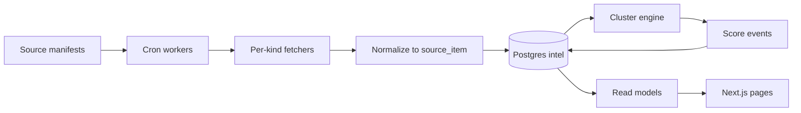

# Live signal dashboard — planning document

*Recovered copy (Cursor plan + Milestone 1 scope). I AM [RESIST] / iamresist.org.*

---

## Executive summary

**Product shift:** Move from “curated feeds of posts” to **event-centric situational awareness**: one canonical record per real-world development, with a **source stack** (primary → wire → specialist → commentary) and **KPI-derived confidence**, not vibe-based importance.

**Design rule (locked):** When a creator and a document disagree, **the document wins**. When a headline and a process disagree, **the process wins**. That implies: procedural/primary signals can **downrank or quarantine** conflicting commentary attachments, and clustering must prefer **stable identifiers** (docket numbers, bill numbers, FR document numbers, EO numbers, hearing IDs) over title similarity.

**Current codebase anchor (Next.js 15):** RSS + Notion split — `lib/data/newswire-sources.js`, `lib/newswire.js`, `lib/voices.js`, `lib/feeds/unifiedArchive.service.js`, `lib/feeds/homepageIntel.service.js`, cache tags + cron under `app/api/cron/`, `app/api/revalidate/route.js`. Intel UI: **Live | Voices | Newswire** (`components/IntelTabs.jsx`; Live → `/intel/live`). Supabase: **shop/orders** today; intel uses **`intel` schema** on the same Postgres.

**North star:** Stop aggregating content first; **aggregate reality first**. The dashboard is an **event board**, not a flat feed page.

---

## Source architecture

### Source classes (taxonomy)

- **PRIMARY** — official state/action (WH, FR, GovInfo, floor, court orders, agency releases, economic release calendars).
- **WIRE** — Reuters/AP-style fast verification (distinct from indie reporting).
- **SPECIALIST** — domain interpreters (SCOTUSblog, Lawfare, Democracy Docket, Brennan Center, etc.).
- **INDIE** — independent outlets already on the site (Democracy Now!, 404, Drop Site, …).
- **COMMENTARY** — creator/video reaction lane (must not carry “what’s confirmed” alone).
- **SCHEDULE** — calendar “landmines” (BLS/BEA/FOMC, hearings, court sitting days).

UI lanes (target IA): **Live | Primary | Wire | Watchdogs | Voices | Archive** — Watchdogs ≈ specialist + selected indie; Archive = slow + timeline.

### Feed registry (concept)

Version-controlled manifest with: `id`, `name`, `slug`, `class`, `jurisdiction`, `branch`, `fetch_kind`, `endpoint`, `parser`, `refresh_seconds`, `reliability_tier`, `fallback_strategy`.

### Refresh intervals (guidance)

- Floor/live Congress: 30–120s, short TTL, stale fallback.
- WH / agency: 2–5m.
- Federal Register API: 2–5m (Public Inspection especially valuable pre-publication).
- GovInfo RSS: 5–15m.
- Wire RSS: 1–5m for live desk.
- Specialist/indie: 5–15m.
- Machine signal (later): 15–60m; never block page render on it.

### Caching boundaries

- **Parse at write time** into DB; public pages read **snapshots** (fast, deterministic).
- **Cron ingest** should use **no-store** fetches — do not rely on Next ISR for ingestion freshness.
- On adapter failure: **last good snapshot** + visible **stale** state; do **not** backfill with commentary.

---

## Data model

### `intel.sources` (registry mirror)

- `slug` (unique), `name`, `provenance_class`, `fetch_kind`, `endpoint_url`, `is_enabled`, timestamps.

### `intel.source_items` (normalized ingested rows)

- `source_id`, `external_id`, `canonical_url`, `title`, `summary`, `published_at`, `fetched_at`, `content_hash`, `structured` jsonb, `cluster_keys` jsonb, **`state_change_type`** (rule-friendly hint for “why it matters” templates — not full procedural stage).
- Unique `(source_id, canonical_url)`.

### `intel.ingest_runs`

- Per source: `status` (running / success / partial / failed), `items_upserted`, `error_message`, `meta`, timestamps.

### `intel.events` + `intel.event_attachments`

- **Deferred past Milestone 1** unless needed; deterministic keys live in `cluster_keys` on `source_items` first.

### Event object (full vision — not all fields required in Milestone 1)

Target fields over time: `id`, `slug`, `title`, `summary`, `first_seen_at`, `last_updated_at`, `status`, `category`, `branch_of_government`, `jurisdiction`, `tags`, source counts, `confirmation_score`, `institutional_impact_score`, `narrative_spread_score`, `editorial_priority`, `confidence_level`, `procedural_stage`, `related_events`, `hero_source_id`, `canonical_source_id`.

---

## Ingestion pipeline

Stages: fetch → normalize → dedupe → attach/cluster → score → publish read models.

---

## Clustering strategy

- **Phase A (Milestone 1):** **Deterministic keys only** — bill IDs, FR document numbers, EO/proclamation numbers, docket/hearing IDs when parseable. **Do not** force every item into an event.
- **Phase B:** Fuzzy merge proposals, **human-gated** — never auto-elevate commentary to canonical.
- **Phase C (optional):** Embeddings for suggestions only, low confidence.

---

## Scoring / ranking

### Full vision (KPIs)

- Signal velocity (distinct publisher families in 15/30/60m).
- Confirmation score (wires + primaries + specialist, capped; commentary does not confirm).
- Primary-source penetration (official PDF, docket, bill text, hearing notice).
- Institutional impact (branch + materiality rubric).
- Procedural progression (statement → filing → hearing → order → vote → implementation) — **process beats headline**.
- Persistence (non-commentary attachment rate over 24/72h).
- Narrative spread (distinct outlet families).
- Curator lift (voices pick up **after** threshold).

### Milestone 1 (simple, explicit)

- Order by provenance: **PRIMARY > WIRE > SPECIALIST > INDIE > COMMENTARY**.
- Within class: **recency**, then stable tie-breakers (e.g. source slug).
- “Why it matters”: **rule templates** from class + `cluster_keys` — no LLM required.

---

## Dashboard IA and UI (target)

### Homepage (later — not Milestone 1)

Above-the-fold **Situation Room**: Live Now, Executive, Congress, Courts, Economy, Elections, International, Alerts, Scheduled Landmines. Journal/shop/music lower or “publication mode.”

### Intel hub

Extend tabs toward: **Live | Primary | Wire | Watchdogs | Voices | Archive**.

### Event card (target)

Title, **why it matters**, confidence, procedural stage, **provenance chips**, last updated, canonical / doc links, expandable source stack.

### UX principles

Dense, legible; provenance and confidence obvious; **no algorithmic hype**; freshness and stale states visible.

---

## Editorial workflow

1. Ingestion: automated, monitored.
2. Clustering: automated proposals + human override for fuzzy merges (queue UI later).
3. Homepage elevation: semi-editorial — auto candidates + pin/suppress with audit.
4. Commentary: always labeled; never canonical for facts.
5. Timeline: curated historical archive; cross-link from live events for context.

---

## Phased roadmap

| Phase | Scope |
|-------|--------|
| **Milestone 1** | Registry (TS manifest), fetchers, normalized storage (`state_change_type` + `cluster_keys`), provenance chips, `/intel/live` only (no homepage strip until stable), simple ranking, deterministic key extraction on items. **No** `events` tables requirement, fuzzy clustering, embeddings, GDELT, Media Cloud, alerts, merge UI, full Situation Room, heavy LLM. |
| **2** | Scheduled landmines panel; more primary endpoints. |
| **3** | Full event board read models; homepage Situation Room. |
| **4** | Machine signal (spike suggestions → editor queue). |
| **5** | Alerts / watchlists. |

---

## Open questions / risks

- **Legal/TOS:** prefer RSS/API/XML; scrapers behind flags and allowlists.
- **Wire access:** some wire domains block datacenter IPs — support **env-configured RSS URLs** or proxy; fail closed (stale snapshot), do not substitute weaker sources silently.
- **False merges:** mitigate with stable IDs + human queue.
- **Volume:** Congress floor spam — rate caps and bucketing per module.
- **Security:** cron secrets, SSRF protection, sanitize HTML, size limits.
- **Bias:** transparent registry; specialist ≠ primary.

---

## Milestone 1 — concrete technical appendix

### Architecture

- **One Postgres** (existing Supabase): schema **`intel`**.
- **TypeScript manifest** (e.g. `lib/intel/signal-sources.ts`), not YAML for now.

### Initial ~10 sources (starter set)

1. White House News — `https://www.whitehouse.gov/news/feed/`
2. White House Presidential Actions — `https://www.whitehouse.gov/presidential-actions/feed/`
3. Federal Register Public Inspection — FR API JSON
4. Federal Register published — FR API JSON
5. GovInfo bills RSS
6. Congressional Record — GovInfo **`crec.xml` verified 200**; **`crec-dd.xml` 404** on GovInfo — ingest uses full CREC RSS, not Daily Digest, until an official DD feed URL is confirmed.
7. Reuters — **optional** `INTEL_REUTERS_RSS_URL` if direct feeds are blocked
8. AP — **optional** `INTEL_AP_RSS_URL`
9. SCOTUSblog RSS
10. Democracy Docket RSS (election/legal specialist)

### Deliverables checklist

- [x] SQL migration: `intel.sources`, `intel.source_items` (incl. `state_change_type`), `intel.ingest_runs` — **`intel.events` deferred**
- [ ] Supabase: apply migration + expose schema `intel` in API settings
- [x] Ingest cron: `GET /api/cron/ingest-signal` (Bearer `CRON_SECRET`)
- [x] Live page: `/intel/live` + Intel **Live** tab (homepage strip explicitly **not** Milestone 1)
- [x] Read path: `unstable_cache` + tag `intel-live` in revalidate list
- [x] COMMENTARY chip on Voices / curated video cards
- [x] Vitest: cluster key parsers (`tests/intel/clusterKeys.test.ts`)

### Deterministic `canonical_key` examples

- `fr:{document_number}`
- `bill:{congress}-{type}-{number}` (from GovInfo `BILLS-…` URLs)
- `eo:{number}` (from presidential action titles)

---

*End of document.*
